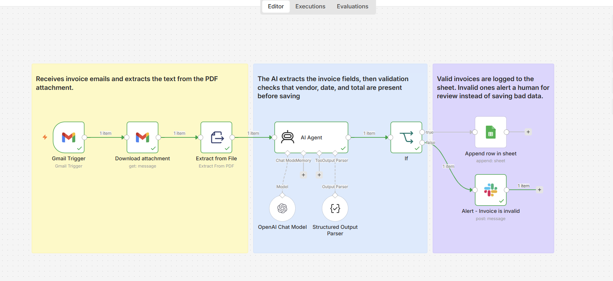
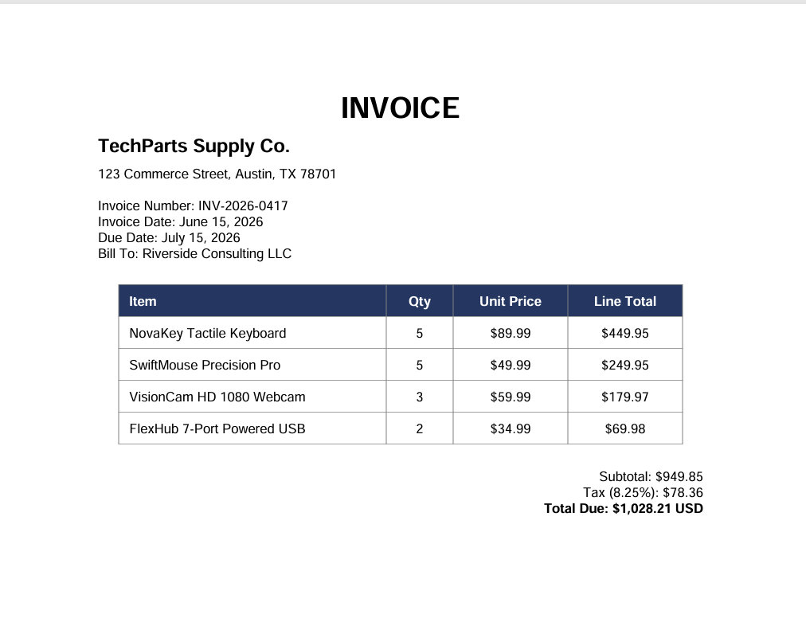
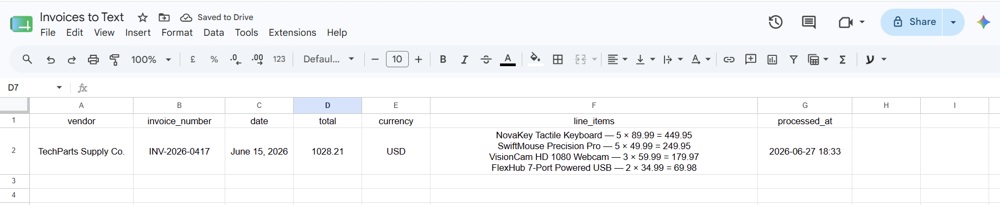
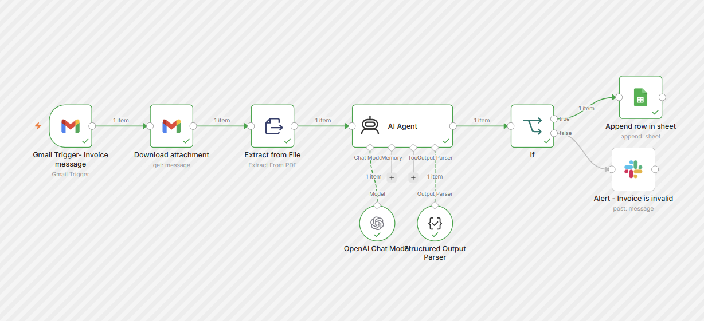
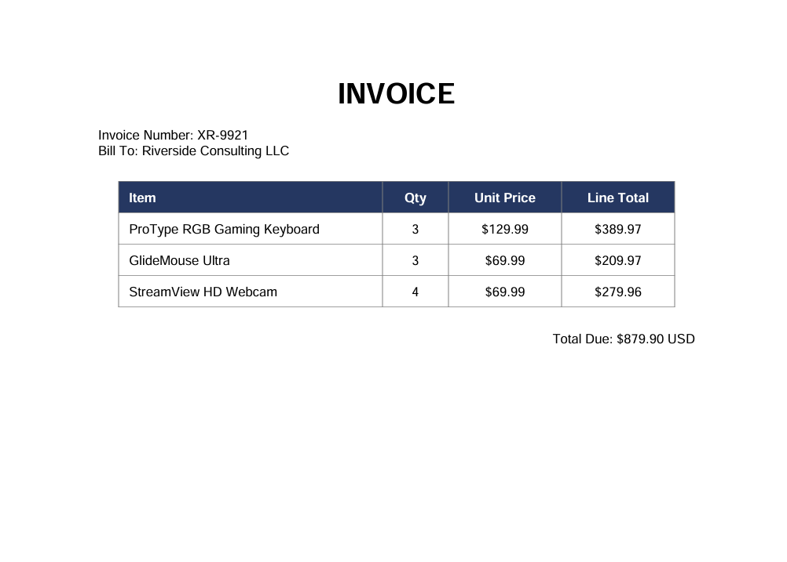
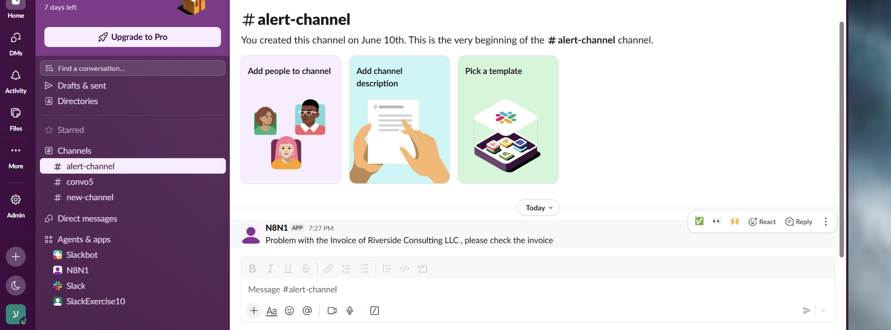
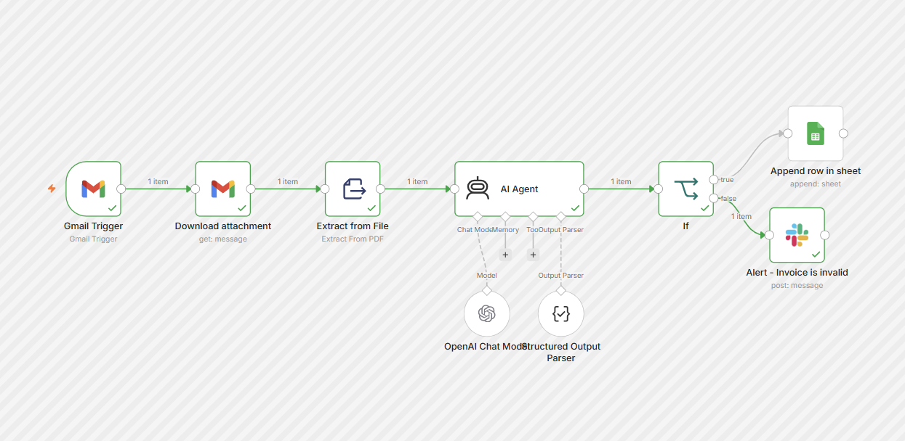

# Automatic Invoice Agent

Every business that pays bills has the same quiet, repetitive chore. An invoice lands in an inbox as a PDF, and someone has to open it, read it, and copy the vendor, the date, the total, and every line item into a spreadsheet by hand. It is slow, it is boring, and it is exactly the kind of task where a tired human types 1028.21 as 1082.21 and nobody notices until the books do not balance.

This project hands that chore to an AI agent. An invoice arrives by email, the workflow reads it, pulls out the important fields, checks that the data makes sense, and logs it to a spreadsheet on its own. If something looks wrong, it does not quietly save bad data. It raises its hand and asks a human to take a look.

Built in n8n with OpenAI, Google Sheets, and Slack.

---

## The Problem

Manual invoice entry is one of the most common back office tasks, and one of the most error prone. The data is structured enough to feel automatable, but messy enough that a naive automation breaks the moment an invoice is laid out a little differently, or a field is missing, or a number is buried in a paragraph.

The hard part is not reading a clean invoice. The hard part is trusting the result. A system that confidently writes the wrong total into your accounting sheet is worse than no system at all. So this project is built around a simple principle: extract what is really there, never guess, and flag anything that fails a sanity check for a human to review.

---

## How It Works

### Stage 1: Receiving and reading the invoice

A Gmail trigger watches the inbox for incoming invoice emails. When one arrives, a download step pulls the PDF attachment as a file, and an extract step turns that PDF into plain text the AI can read.

This is the kind of invoice that comes in. A real document, with a vendor, a date, line items, and a total scattered across the page in the usual layout.

---

### Stage 2: Extracting the fields

The text goes to an AI agent built on OpenAI, paired with a structured output parser. The agent reads the invoice and returns a clean, structured object: the vendor, the invoice number, the date, the total, the currency, and a list of line items, each with its own name, quantity, unit price, and line total.

The agent is given one firm rule. It extracts only what is actually present on the invoice. If a field is missing, it leaves that field empty rather than inventing a value. An empty field is acceptable. A guessed field is not. For financial data, a confident wrong answer is the most dangerous answer of all.

---

### Stage 3: Validating, then logging or alerting

Before anything is written to the sheet, an IF node checks the extracted data. It confirms the vendor is present, the date is present, the total is present, and the total is a real number.

If every check passes, the invoice is written as a new row in a Google Sheet, with the line items flattened into a clean summary and a timestamp recording when it was processed. If any check fails, the invoice never touches the sheet. Instead, a Slack alert is sent to a review channel, naming the vendor and asking a person to check it manually. Bad data is stopped at the door.

---

## Seeing It Work

### A Valid Invoice, Logged Cleanly

When a complete invoice comes in, every field is extracted, the validation passes, and the row lands in the sheet. The line items are flattened into one tidy cell, and a processed timestamp is added automatically.

---

### The Sheet Append, on the Canvas

The same successful run, shown on the workflow itself.

---

### A Broken Invoice, Caught and Flagged

This invoice is missing its vendor and its date. Those two fields cannot be guessed from anything else on the page, so the agent correctly leaves them empty.

Because the required fields are missing, validation fails and the workflow refuses to save it. Instead, it posts an alert to a Slack channel so a human knows to step in.

---

### The Slack Alert, on the Canvas

The same flagged run, shown on the workflow itself.

---

## A Note on Honesty in Extraction

One genuinely interesting thing surfaced while building this. The validation deliberately checks the vendor and the date, not whether the line items add up to the total. The reason is subtle. When an invoice has no printed total, the AI will helpfully calculate one by summing the line items, because to the model that feels like being useful rather than inventing data. So a missing total is not a reliable signal that something is wrong.

The vendor and the date, by contrast, cannot be derived from anything else on the invoice. If they are missing, they are truly missing. That makes them honest checks. It is a small design decision, but it captures the real lesson of working with these models: they will fill gaps when they can, so your validation has to lean on the things they cannot reconstruct.

---

## Features I Used

- **Gmail trigger:** watches an inbox and starts the workflow on a new invoice email
- **Download and Extract from File:** pulls the PDF attachment and reads its text
- **AI Agent with OpenAI:** extracts the invoice fields from messy text
- **Structured Output Parser:** forces the AI into a clean, predictable data shape
- **IF node validation:** checks required fields before any data is saved
- **Google Sheets:** logs valid invoices as structured rows
- **Slack:** alerts a human when an invoice fails validation
- **Expressions:** flatten a variable list of line items into a readable cell and add a processed timestamp

---

## Try It Yourself

You can import and run this system in your own n8n:

1. Download the workflow from the `json-files` folder and import it (Workflows, then import from file).
2. Connect your own credentials: a Gmail account for the trigger, OpenAI for the agent, Google Sheets for logging, and Slack for alerts.
3. Create a Google Sheet with these columns: vendor, invoice_number, date, total, currency, line_items, processed_at.
4. Send yourself one of the sample invoices as a PDF attachment and watch it flow through.

Two sample invoices are included in the `invoice-samples` folder. The valid one has every field and will be logged to the sheet. The broken one is missing its vendor and date and will be routed to the Slack alert instead.

There is no live public link to interact with, since that would mean keeping my own inbox, workflow, and credentials running publicly. Importing the workflow lets you run the whole system on your own setup.

---

## Files

- `json-files/` the workflow, ready to import into n8n
- `canvas/sticky-notes.png` the labeled workflow canvas
- `canvas/successful-executions/` the successful sheet and Slack runs
- `invoice-samples/` a valid and a broken sample invoice to test both paths
- `sheet-photo/` the logged invoice in Google Sheets
- `slack-alert/` the Slack alert for an invalid invoice

*Note: API keys and credentials have been removed from the exported workflow. To run this yourself, connect your own OpenAI, Google Sheets, Gmail, and Slack credentials in n8n.*
